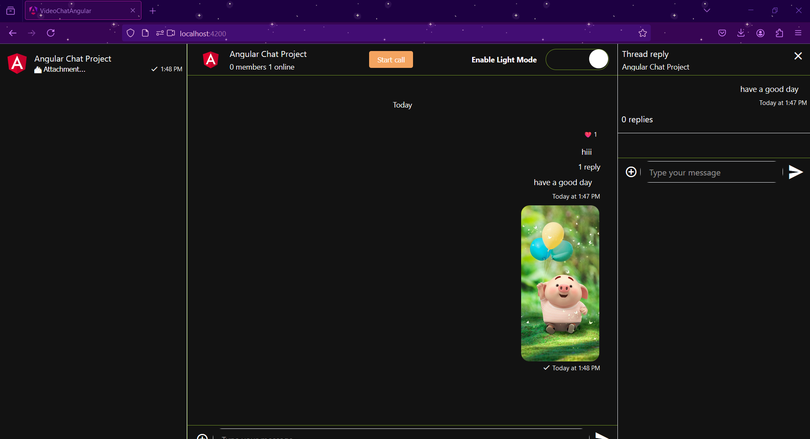

# Real-Time Communication App

## 🚀 Overview

The **Real-Time Communication App** is a dynamic web application designed to enhance communication through seamless chat, audio, and video calling functionalities. Built using **Angular** and **TypeScript**, this app bridges distances and fosters connections, making it easier for individuals and teams to interact in real-time.

## 🌟 Features

- **Real-Time Chat**: Engage in instant messaging with threaded replies for context-rich conversations.
- **Media Sharing**: Effortlessly share images, videos, and files within the chat to enhance collaboration.
- **Dark Mode**: Enjoy a visually comfortable experience with a toggle feature for light and dark themes.
- **Audio & Video Calls**: Initiate high-quality audio and video calls with participants for face-to-face interactions.
- **Participant Management**: View and manage participants in a call with real-time video feeds.

## 📸 Application Snapshots

### Chat Interface

### Thread Replies

### Dark Mode Toggle

## 🛠️ Technology Stack

This project leverages the following technologies:

- **Angular**: For building a responsive and dynamic front-end.
- **TypeScript**: Enhancing code quality and maintainability.
- **Node.js**: Supporting server-side capabilities for real-time features.

🔍 Key Concepts Utilized

    Lifecycle Hooks: Efficiently manage component states and resource allocation.
    Testing: Implement robust unit tests to ensure reliability and functionality.
    Responsive Design: Create an adaptable UI that looks great on any device.
    Reactive Programming: Utilize Angular Signals and Observables for seamless data flow.
